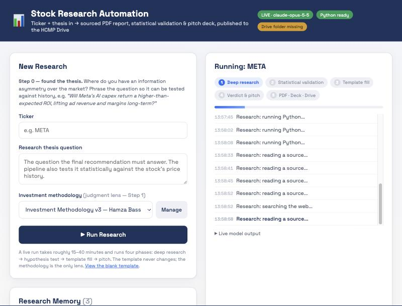
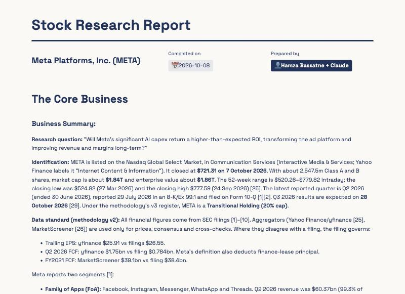

# Stock Research Automation

**Ticker + thesis in → sourced equity-research report, statistical thesis test, PDF and investment-committee pitch deck out.**

A local web app that automates a complete sell-side-style stock research workflow end to end: an autonomous research agent built
on the Claude API with web search, a real hypothesis test in Python on market data, a fixed report template rendered to PDF, a
`.pptx` pitch deck with speaker notes, and publishing of every artefact to a synced Google Drive folder.

<p align="center">
  
</p>

## What a run produces

| Phase | What happens | Output |
|---|---|---|
| **1 · Deep research** | An agentic loop on `claude-opus-5-5` with `web_search`, `web_fetch` and a local `run_python` tool reads filings, investor-relations pages, earnings-call transcripts, Reddit and Glassdoor, and compiles a fully sourced dossier: business model, growth, profitability, segments, competition, moats, valuation, earnings record, capital allocation, three-case DCF, SWOT, categorisation. | `research.md` |
| **2 · Statistical validation** | A second agent designs and runs a hypothesis test on real price data (yfinance): market-model abnormal returns strip out market and sector effects, then a t-test / OLS / event study answers "has the thesis variable historically moved this stock?" with t-stat, p-value, R², n and a robustness check. Every script and its output is logged. | `stats.md`, `python_log.md` |
| **3 · Template fill** | The dossier is poured into a constant HTML report template (every table, class and section preserved) and rendered to PDF with Puppeteer. | `report.html`, `report.pdf` |
| **4 · Verdict & pitch** | A structured-output call extracts the recommendation, archetype, Business/Operations/Valuation verdict, kill signal and time horizon, and writes a six-part investment-committee pitch: slide content with stat tiles and speaker notes, a 5–7 minute talk track, and the eight hardest committee questions with answers. The deck is built with pptxgenjs. | `deck.pptx`, `pitch.md`, `meta.json` |
| **Publish** | All artefacts are copied to `<Drive>/Stock Theses & Research/<Company (TICKER)>/` with the publish date in every filename. | Drive |

The **investment methodology is pluggable**: upload any methodology (PDF, Markdown, text) once and it becomes the exclusive
judgment lens for every subjective call. The report template never changes.

<p align="center">
  
</p>

## Example output

A real run is in [`examples/`](examples/): the full META research report (PDF) and the generated investment-committee deck (PPTX).

## Try the demo (no API key needed)

```bash
git clone https://github.com/hamzabass16/stock-research-automation.git && cd stock-research-automation
npm install
cp .env.example .env            # leave ANTHROPIC_API_KEY empty → DEMO MODE
npm start                       # http://localhost:4317
```

Demo mode walks through the whole UI with mock output: the run panel, phase progress, the generated PDF, the pitch deck and the
Drive publishing step (pointed at a local folder via `DRIVE_PUBLISH_DIR` if you have no Google Drive mount).

### Going live

```bash
npm run setup:python            # .venv with numpy / pandas / scipy / statsmodels / yfinance for the hypothesis test
```

Add `ANTHROPIC_API_KEY` to `.env`, keep `DEMO_MODE=false`, restart. A live run takes 15–40 minutes and costs a few dollars on
Opus 5.5 at `RESEARCH_EFFORT=high` (lower the effort or the `MAX_WEB_*` caps to trade depth for cost).

| Key | Purpose |
|---|---|
| `ANTHROPIC_API_KEY` | Powers all four phases |
| `DEMO_MODE` | `true` = mock output, no API calls |
| `ANTHROPIC_MODEL`, `RESEARCH_EFFORT` | Model and effort (`low` … `max`) |
| `PREPARED_BY` | Listed as the preparer on every report and deck |
| `DRIVE_PUBLISH_DIR` | Override the publish folder (defaults to the synced Google Drive "Stock Theses & Research" folder) |

## How it is built

```
server.js            Express API + background run worker (PDF → deck → publish after the pipeline)
lib/pipeline.js      The four phases: agentic loop with client + server tools, pause_turn resumption, max_tokens continuation
lib/prompts.js       Every prompt and the JSON schema for the structured verdict/pitch
lib/claude.js        Anthropic SDK client: streaming, adaptive thinking + effort, prompt caching, refusal fallbacks, usage accounting
lib/python.js        Sandboxed local Python runner (project venv, -I, timeouts, output caps)
lib/template.js      The constant report template (HTML + CSS)
lib/deck.js          pptxgenjs deck from the structured pitch
lib/publish.js       Dated publishing into the synced Drive folder, one subfolder per company
lib/store.js         Local persistence, per-run artefact folders, fast dedup, bundled-methodology seeding
lib/markdown.js      Renders Markdown artefacts in the browser
public/              Vanilla-JS UI: phase tracker, live model output, research memory
```

Design choices worth noting:

- **Research and judgement are separated.** Facts come from primary sources via web tools; every opinion is forced through the
  uploaded methodology. Swapping the methodology changes the verdict, not the data.
- **The thesis has to survive a test.** The statistical phase is a separate agent with its own prompt so it cannot be skipped,
  and it must report honestly when the data does not support the story.
- **Long outputs are streamed and resumable.** Server-tool `pause_turn`s are resumed, `max_tokens` cut-offs continue where they
  stopped, and the growing conversation is prompt-cached turn after turn.
- **Everything is a file.** Each run is a folder of Markdown, HTML, PDF, PPTX and JSON that can be inspected, re-published or
  challenged (the guide's advice: if a derivation looks weak, open the Python log and re-run it yourself).

## Status

Working prototype used for real research. Known limitations: single-user local app, no tests beyond manual verification, the
Drive integration relies on Google Drive for desktop rather than the Drive API, and PDF rendering needs Chromium via Puppeteer.

## License

MIT
